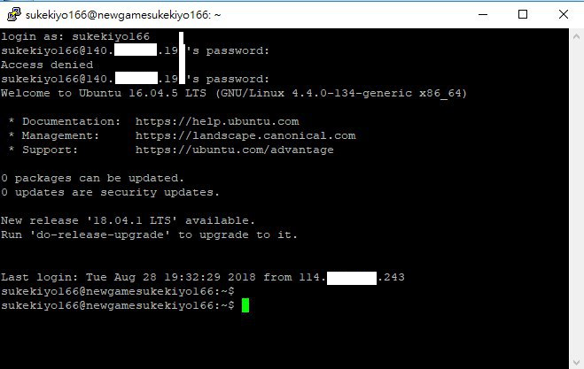
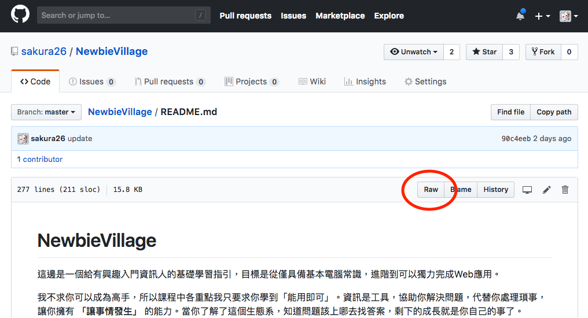

# NewbieVillage

這邊是一個給有興趣入門資訊人的基礎學習指引，目標是從僅具備基本電腦常識，進階到可以獨力完成Web應用。

我不求你可以成為高手，所以課程中各重點我只要求你學到「能用即可」。資訊是工具，協助你解決問題，代替你處理瑣事，讓你擁有 **「讓事情發生」** 的能力。當你了解了這個生態系，知道問題該上哪去找答案，剩下的成長就是你自己的事了。

我的身份是一個引導者，告訴你有哪些關卡要過，通關條件是什麼，有哪些資源可以收集，幫你鑑定什麼是有用的，什麼你可以跳過。我不會開課教你，也不會幫你收集資料，要離開新手村，得要你自己動手。

期待資訊能為你所用，成為你的力量


## 離開新手村的條件

* 一份看起來還不錯的線上履歷（或者該說是，自我介紹）
* 一份獨力完成的Web專案
  * 開放原始碼，並選定一個License
  * 提供線上服務
  * 這個專案至少幫到一個人，那個人最好是你

為了達成這件事，你至少需要...

## 技能樹

* 網站前端技能
  * 三大頭
    * HTML5 - 描述一個頁面上有哪些物件
    * CSS - 描述一個物件該有的色彩與外型
    * JavaScript - 描述頁面該怎麼跟使用者互動
  * 基本框架與套件
    * Bootstrap - 協助你快速產生一個還算漂亮的網頁
    * jQuery - 協助你更簡單的使用JavaScript
* 網站後端技能
  * Ruby - 一個快速開發的語言，與電腦溝通的方式
  * Rails - 幫你把伺服器所有的東西都寫好，方便你引用完成自己的網站
  * 資料庫操作 - 一個方便你儲存資料的地方
* Linux操作技能 - 網站總是要有個地方放，在你誤入Windows陷阱而崩潰之前，先拉你來Linux
* 網路基本技能 - 為什麼網站無法顯示？在你急急忙忙打電話之前，先試試這個
* 使用協作工具
  * git 方便你管理程式碼，寫壞了隨時可以回溯，在多人合作時不用打架

### FAQ

*Q: 好多程式語言要學 QAQ*

* 是的，不過不要被這個嚇到了。學習語言最困難的地方在理解對方的思路，也就是理解電腦的思路。一旦你了解一個語言，其他的很快都可以take起來。很多人學第一個語言要花一年，第二個三個月就好，第三個可能一邊Google一邊就開始寫了。現在我能使用的語言大概有十來種。
* 我學會的第一個語言就是copy別人的範例來改，也就這樣而已，多寫就上手了。
* 所有語言都一樣，用了才會，大量寫就對了。
* 別背單字（語法），尤其是可以查Google的時候

*Q: 為什麼選擇RoR與Bootstrap？*

* “快速開發”、“可獨力完成”、“薪水高且搶手”這三大優勢。他不是最好的語言，不過只有你的開發速度越快，累積的經驗越多，你才能越早走上正軌
* 一個好的開發者不會只用一種語言。語言與框架不過是工具，在不同的情境下使用不同的工具是一個熟練開發者的基本。

*Q: 好多英文 QAQ*

* 請大家做好心理準備的是，資訊毫無疑問是一個英文為主要溝通語言的世界。絕大多數資料你都會需要上英文網站去查詢，而中文在很多指令與程式中很容易給你帶來意料之外的麻煩。
* 幸好的是，科技類英文比起一般英文簡單好用很多，只要願意看，可以很快地累積成就感～

## 資源列表

**正式課程**

* 六角學院線上課程 <http://www.hexschool.com/courses>
  * 先 HTML/CSS + jQuery
  * 然後 Bootstrap4 + JavaScript
* 五倍紅寶石實體課程 <https://5xruby.tw/talks>
* 五倍紅寶石線上課程 <https://backerfounder.typeform.com/to/SgY7kv>

**免費資源**

* [Git入門](https://backlog.com/git-tutorial/tw/) 可能有點硬，實際上你們用到的應該沒這麼多
  * [VIM入門](https://gitbook.tw/chapters/command-line/vim-introduction.html) 雖然這應該放到linux基礎...有時git命令如commit或merge會跳進vim的介面讓你輸入註釋，如果你被trapped住了，請來看這邊
* [鳥哥的linux](http://linux.vbird.org/linux_basic/) 也有點硬，我找找有沒有書...不過這是很棒的一個網站，我剛學的時候都上來查資料，所以有餘力都讀過會很有幫助
* 前端
  * [JavaScript小遊戲: 程式碼RPG](https://codecombat.com/play) 記得語言選JavaScript
    * [註冊完加一下公會](https://codecombat.com/clans/5b88ddbf27e3f90035913f2d)
    * 第一個森林通關者有特殊禮物
  * [CSS小遊戲: 找到你的午餐](https://flukeout.github.io/) 等CSS念到一半就可以來玩，很可愛的小遊戲，請以玩到通關為目標
  * [CSS小遊戲: FLEXBOX FROGGY](https://flexboxfroggy.com/)
  * [CSS小遊戲: GRID GARDEN](http://cssgridgarden.com/)
  * [W3School線上課程 啥都有](http://www.w3school.com.cn)
  * [JavaScript線上教學](https://www.codecademy.com/learn/introduction-to-javascript)
  * [從網站開始刻120分鐘試閱](https://www.everyonecanwebsite.com/)
  * [Web前端开发 -使用 HTML, CSS, Javascript, jQuery,HTML5、CSS3 等建立网站ㄊ](https://www.udemy.com/web-html-css-javascript-jqueryhtml5css3/)

**書籍**

* [為你自己學GIT](https://gitbook.tw/)
  * 章節1-6
  * 章節10 遠端共同協作
* [跟阿銘學Linux](https://www.kingstone.com.tw/book/book_page.asp?kmcode=2014713560278&Actid=tornado)
  * 章節1 學習之初
  * 章節3 遠端登入Linux系統
  * 章節4 Linux檔案與目錄管理
  * 章節5 Linux使用者管理
  * 章節6.1 查看磁碟或目錄的容量
  * 章節7 VIM文字編輯器
  * 章節8 檔案壓縮與打包
  * 章節9 安裝RPM套件
  * 章節10 shell基本認識
  * 選修
    * 章節2 安裝CentOS
    * 章節12 Shell Script
    * 章節13 Linux系統管理技巧
    * 章節14 LAMP
    * 章節16 MySQL操作
* [為你自己學 Ruby on Rails](https://railsbook.tw/)
  * 章節 1-22
  * 章節 27-32
* 前端書籍待補

## 讀書會

有碰面就有激勵，所以來約個實體讀書會吧

* 週期：每週一次 
* 當前週期的書：
* 每週挑戰：

最主要的任務是：跟大家分享一下這週你讀了些什麼，做了些什麼，哪些特別引起你的注意（或踩了什麼雷），以及接下來預定要讀些什麼

如果當日有事無法現場到，也可以先把想分享的內容打好貼到這邊

要特別留意的是：請平常就找時間看書，讀書會不是給你現場抱佛腳用的。當然分享完可以現場念沒關係，但別忘了唸書的時間以及實作範例的時間都不是短短的讀書會時間可以讓你補完的

## 任務列表

### 新手任務Lv.0

* 擁有一個Github帳號，這裡會是你公開程式碼與成果的地方
  * <https://github.com/>
  * <http://blog.kevinlinul.idv.tw/?p=369>
  * **檢查點：請把你的Github帳號的網址傳給我**
* 登入練習機（Linux Ubuntu 16.04）
  * 練習機資訊我已經個別私訊給各位
  * **檢查點：請把你第一次登入成功的畫面截圖給我**
* 認識環境：編輯器
  * 安裝[sublime text 3](https://www.sublimetext.com/3)
  * [sublime text 3課程](https://www.udemy.com/sublime-text-3/)
  * 或你可以[選擇別的](http://rubyer.me/blog/84/)如 [Notepad++](https://notepad-plus-plus.org/zh/) / [Rubymine](https://www.jetbrains.com/ruby/) / [NetBeans](https://netbeans.org/) / [Eclipse](https://www.eclipse.org/) / [Aptana Studio](http://www.aptana.com/) 甚至筆記本，教學自己Google
  * [外掛模組也裝一下](https://blog.miniasp.com/post/2014/01/06/Useful-tool-Sublime-Text-3-Quick-Start.aspx)
  * **檢查點：請把編輯器打開的畫面截圖給我**
* 排定唸書的時間
  * 一週至少四小時實體讀書會，分享學習心得
  * 一週唸書的時間至少8hr
  * 請主動於群組回報並敲定時間
  * **檢查點：請個別回報讀書規劃給我**

關於Github

* Github是一個讓大家放自己的專案的地方，給大家看一下我的 <https://github.com/sakura26>
  * 首頁以可以看到我做了哪些專案，你可以看到我有哪些專案是大家有興趣的。特別的地方是，你可以看到有星星跟分岔的符號後面跟著數字，星星代表有多少人喜歡你的專案，而分岔代表有人覺得這份專案很棒，建立了一份分枝來改成自己的版本
  * 而下方則是我在這一年內的所有活動，例如修改程式碼、提供貢獻給其他專案等等，高活躍度的人很容易就看得出來
* 至於一個常見的專案長什麼樣？這是我在Github上的第一個專案，[自爆按鈕（？）](https://github.com/sakura26/killallbtn)
  * 在上方有一個狀態列，紀錄了這個專案經歷了六次修改（commits），一個分支（branch），一個開發者（contributor），以及使用哪一種授權公開（這邊用的是BSD授權）
  * 檔案右邊你可以看到最後修改時間、最後修改的意見、點進檔案就可以看到內容
* 他不只可以用來公開你的專案原始碼，我也常常把它拿來當blog寫 [我的釀酒部落格](https://github.com/sakura26/ethanol)
  * 既然要把他當blog寫，總是會想貼點圖或寫得文情並茂一點，這個時候請參考這邊
Github支援顯示的語法有好幾種，但最主要也最好用的叫做Markdown
[語法](https://guides.github.com/features/mastering-markdown/)
  * Markdown的副檔名是 .md 
他是一種，就算你沒有專屬編輯器，打開檔案看起來也會很舒服的一種檔案格式
例如這是我[8/6的釀酒紀錄](https://github.com/sakura26/ethanol/blob/master/brewingHistory/180806-ethen-belgianpaleale.md
)，[原始碼長這樣](https://raw.githubusercontent.com/sakura26/ethanol/master/brewingHistory/180806-ethen-belgianpaleale.md)
  * MD的設計概念就是文字為本體，用人看得懂的方式略為修飾就好。也有線上編輯器，可以一邊打就直接看到出來的結果長怎樣。例如這是我正在學[GoLang的筆記](https://hackmd.io/5RTwaiTSSNqblbNSTqvxmA?both)
* 同時你也可以用它架設你的網站（只限靜態頁面），因此很適合作為純前端展示之用。這是我幫TDOH做的技能樹的網站，實際上就是由Github提供服務的 [駭客學習地圖](http://map.tdohacker.org/) ＝ [原始碼](https://github.com/tdoh/map) 

雖然Git的東西好像很多，不過一般來說你只會用到五個命令而已

* 第一次把專案複製下來的 git clone
* 看系統狀態的 git status
* 把新增或修改的檔案加進去 git add -A
* 確認修改做一次提交 git commit -m "your comments"
* 把程式碼送到遠端同步 git push

只有在多人的情況下，你可能會用到 fetch, pull, checkout, merge等等的，到時候再查吧

關於vi / vim

* Linux上預設的編輯器是vi, 自然也是git的預設編輯器。雖然他很不直覺，不過跟Git一樣，我們一般只會用到幾個命令
* 切換指令與編輯模式：一般來說vi就是兩個模式，剛進去的時候是指令。指令模式允許你做一些操作，就像在程式的功能表中一樣，編輯則是在檔案內容中遊走編修。從指令模式切換到編輯模式按i，從編輯模式脫離按ESC。如果你不確定你在什麼模式，就多按幾下ESC吧 
* 在指令模式下，
  * 存檔是 :w
  * 存檔同時退出vi :wq
  * 不要存檔退出 :!q
  * 搜尋字串abc /abc
* 還有很多快速鍵幫你加速操作，不過一般來說你記住這幾個就夠了

關於第一次登入Linux主機

* 請使用ssh連線上去，他沒有視窗沒有桌面，完全是指令行
* 登入的方式請參考[這篇](https://ph302.cs.pu.edu.tw/putty.htm)
* 請從這邊下載[putty](https://the.earth.li/~sgtatham/putty/latest/w64/putty.exe)



* 這個畫面代表你成功登入了這台主機，這是這台主機給你的歡迎畫面，一些簡介，而最後一行代表機器在等待你輸入指令
* <你的帳號>@<這台主機名稱>:<你現在的目錄>$ 
* 你現在的身份是一般使用者，所以結尾是$，如果是特權帳號，結尾則是#
* 以這個例子來說，帳號是sukekiyo166，主機名稱是newgamesukekiyo166，你現在的目錄是~，代表你的家目錄的縮寫，實際上完整路徑是 /home/sukekiyo166
* 你現在只需要確認你可以連上去就好，接下來開始學linux基礎的時候，所有的練習都在這上面進行，同時接下來學RoR的時候，架設伺服器也會使用這一台。
* 你可以任意使用它，搞壞了跟我說，我幫你做系統還原（不過所有你在上面的資料也都會消失）

### 新手任務Lv.1

* 以純HTML完成一個網頁介紹你最喜歡的作品（小說/漫畫/電影...）
  * 請插入至少一張圖片
  * 程式碼需推上Github
  * **檢查點：給我網址**
* 同上，以Markdown語言做相同的事
  * 程式碼需推上Github
  * **檢查點：給我網址**
* 在Linux(Ubuntu)上安裝Ruby & Rails環境
  * [安裝指引](https://railsbook.tw/chapters/02-environment-setup.html)
  * **檢查點：給我截圖**
* 完成Ruby的“Hello World”初體驗
  * [指引](https://www.ruby-lang.org/zh_tw/documentation/quickstart/)
  * **檢查點：給我截圖**

Linux權限

* ubuntu預設的權限是一般使用者，也就是你使用帳戶登進去的權限，可以做一些寫code、下載檔案之類的行為。
* 而有一個最大權限的帳戶叫root, 跟神一樣可以為所欲為。root這個帳號權限太可怕了，很容易引發一些災難，例如不小心手滑大陸就少一半或世界就毀滅了，所以一般不允許root身份登入
* 取而代之的是，使用sudo命令，這個命令可以允許你使用root的權限去做事，每次做這些事的時候都打入sudo是一種警醒，避免自己做出危險的行為
* 而大多數的程式安裝都需要root身份，因為諸如系統共用函式庫 /lib 之類的地方都等同於只有神才有權限的造陸工程
* 所以，假設原本 bash install.sh 告訴你權限不足，有時改成 sudo bash install.sh就可以了
* 而一般安裝命令的說明會告訴你該用什麼身份來執行，如果他告訴你要用root身份卻沒有在指令前面加sudo, 自己加上去就是了

安裝Ruby

* 安裝的指令不難，大致上如同指引所述，不過有一點要留意：安裝到rvm的地方的時候他可能會跟你抱怨gpg憑證匯不進去或無法編譯native-gem。如果你遇到相同的問題，這麼做：

```
# 安裝系統套件
$ sudo apt install -y build-essential zlib1g-dev ruby-dev sqlite3 libsqlite3-dev libssl-dev libreadline-dev libyaml-dev libcurl4-openssl-dev curl git-core python-software-properties nodejs
# 安裝MySQL資料庫（這邊會問你資料庫的密碼）
$ sudo apt -y install mysql-server mysql-client libmysqlclient-dev
# 匯入金鑰
$ gpg --keyserver hkp://keys.gnupg.net --recv-keys 409B6B1796C275462A1703113804BB82D39DC0E3 7D2BAF1CF37B13E2069D6956105BD0E739499BDB
# 安裝 rvm
$ \curl -sSL https://get.rvm.io | bash -s stable
# 安裝 rails
$ sudo gem install rails
```

* 注意前面的 # 與 $ 符號，這代表了目前這個命令是以什麼身份執行的，一般身份會顯示為 $, 特權身份則為 # ，算是閱讀指引時的一個hint, 不要直接整段複製去執行囉。你會注意到特權身份的 # 本身也代表了註解，這是為了怕有人不小心貼上跑了指令把東西搞壞了
* 每個命令執行都會從螢幕上得到一串回覆訊息，這些內容很重要最好閱讀過，尤其是尋找裡面有Error / Fatal / failed之類的語句，他會告訴你什麼地方出了問題，然後你就可以去Google找解答。很多時候命令是彼此相依的，中間失敗了下面就一起噴掉了
* 建立專案的時候，他可能會跟你要求指定版本的ruby與安裝套件```bundle install```

關於Linux命令

* 有些時候你會不知道一個命令是做什麼的，或是他有哪些參數可以用，例如你想印出rails的版本編號。
* Linux裡面一般有幾個方式你可以去查詢，man的命令讓你查詢特定指令的用法，而多數命令有內建--help參數來讓你查詢用法，例如
  * ```man rails ```
  * ```rails -v```
* 當然，直接去Google也是個好辦法，不過偶而你會發現它給你的方法不一定work, 因為版本不同支援的參數也可能不同，這個時候回頭用man還是比較保險的

HTML的幾個常見問題

* 一般來說html檔案會以.html為副檔名，或是.htm, 雖然推薦用完整的.html
* 你可能會想我寫的這個html檔該放到哪去，我會建議你把檔案放到你的git專案目錄下，用git命令推上去之後再給我連結。不是很建議你直接在github的頁面上修改，他會模擬你的身份去做git操作，然後就變成一個github上的版本跟你電腦上不一致，你下次git命令就會跟你抱怨要你做pull跟merge了，多一個麻煩
* html / head / body 標籤是很重要的基礎結構，而且一般一個網頁只允許一組，不要交錯或放錯位置了
* 標籤結構長得像這樣 ```<tag arg1="aaa" arg2=123>``` ，如果參數內文是字串就用" "匡起來，數字則不用筐。標籤名稱與可以使用哪些參數請參照html定義
* 標籤務必成對，例如 ```<a href="xxx"> xxx </img> </a>```。雖然有少數標籤是允許單一出現的，例如```<hr>```，不過我也會建議用```<hr />```的方式來寫，註明這個標籤依然是成對的只是我不寫出來。
* 引用圖片或連結時避免用到你電腦上的路徑，這樣會導致別人的電腦在看的時候找不到檔案，就一個叉燒包。 錯誤示範：``````
* HTML是一種巢狀式標籤，每個標籤的使用“不可以交錯”，例如font標籤在這邊橫跨了p標籤就是不合法的
  * 錯誤示範：```<p><font></p><p></p></font>```
  * 正確：```<p><font></font></p> <p><font></font></p>```
* 貼圖的部分，引用了很多別的網站的外部圖片，這樣不是不行，我也會偷懶這麼做。不過正式來說，圖片放在自己的空間比較好，免得別人刪檔案你這邊叉燒包
  * 你可以在git上開一個img資料夾，把下載來的圖片pic.jpg丟進去，然後你就可以用/img/pic.jpg去引用了，可以參考這篇的原始碼
* iframe很好用，不過基於他有一些安全性問題，加上畫面會很醜，我們很少用就是
* 你使用了```<font face="微軟正黑體" color="000000" size="3">```的方式指定字體，這樣很好，不過跟本地圖片有一樣的問題：只有別人有安裝微軟正黑體的電腦才能顯示你預期的樣子。所以我們一般來說有幾種解法：
  * 1.挑windows/mac都有的保險的字體，通通列進去讓電腦自己取挑 
  * 2.進階：使用web字體例如 [google](http://www.flycan.com/article/css/google-fonts-webfont-2474.html) 或 [justfont](https://www.justfont.com) 
  * 3.進階：自己包字體 
  * 4.使用特殊字體的地方通通用圖片處理

Markdown

* 同HTML, 你可以直接推到Github去，github會主動幫你解釋並呈現
* 你也可以用 [HackMD](https://hackmd.io/) 也很方便，可以線上即時看到編輯的結果
* MD中也可以使用HTML語法，不過我希望你以MD語法為主，畢竟這是一個練習
* 你可以檢視這篇Readme的原始碼來看我怎麼使用的，拉到最上面點選README.md之後右上角有一個“Raw”的按鈕可以按
* 更多的教學 
  * <https://guides.github.com/features/mastering-markdown/>
  * <https://markdown.tw/>
  * <https://www.jianshu.com/p/q81RER>



### 新手任務Lv.2

* 製作一個網頁，請用JavaScript/jQuery加入「輸入生日，計算年齡，未滿18歲送去迪士尼」的功能
  * 考驗的是 使用jQuery的能力 字串解析、日期換算、重新導向等。你也可以單純利用JavaScript來實現這個功能。你也會想看一下HTML的表單
  * 進一步，你可以使用Bootstrap的模組 [Datepicker](https://jqueryui.com/datepicker/) 來讓使用者輸入日期更簡便
  * 程式碼需推上Github
  * **檢查點：給我網址**
* 完成RoR的“Hello World”初體驗
  * [指引](https://ihower.tw/rails/firststep.html)
  * 程式碼需推上Github
  * **檢查點：給我網址**
* 把Lv1「介紹你最喜歡的作品」用CSS裝飾得更美觀
  * 程式碼需推上Github
  * **檢查點：給我網址**
* 新增任務：設置Github pages, 以後交前端作業請都以此繳交
  * [教學](https://gitbook.tw/chapters/github/using-github-pages.html)
  * **檢查點：用妳的github pages繳交作業**

關於HTML，進階一點

* 還記得HTML的表單吧？定義一個form, 然後裡面可以有多個輸入欄，然後有一個reset跟一個submit按鈕
* 如果你只是表單不要做操作，Datepicker使用者點完之後出現那個數值就已經在欄位裡了，送出就會跟著送出去。而如果你要拿這個欄位裡的數值，請參照jquery（基本上javascript就可以拿了，不過jquery比較簡單一點）
* HTML的核心都在DOM物件，大部分的資訊也都儲存在DOM裡面。基本上你在HTML中寫個每一個文字、標籤什麼的，都會轉換成DOM物件被放置在網頁上。
* 你可以想像HTML是網頁的設計圖，而瀏覽器會幫你像蓋房子一樣生成DOM物件放在頁面上，最終疊成你看到的樣子

關於網站與使用者（HTTP Server/Client架構）

* 當使用者打開一個網頁時，實際上發生的事情是這樣的
* 使用者在瀏覽器上輸入網址，瀏覽器透過網址的URL，查詢DNS, 找到Server的IP位址進行連線
* URL長這樣 http://www.ccsakura-net.com/index.htm ，可以拆成幾個元素
  * 使用http通訊協定（未加密）
  * 主機位址在www.ccsakura-net.com，透過DNS查詢 => 140.121.80.29
  * 跟主機要求的URI是 /index.htm ，一般是對應到檔案，在MVC架構中則是指引Routing的關鍵字（參閱Lv3 MVC）
* 瀏覽器連到Server，把主機位址、URI與一些瀏覽器端（Client）的資料發送給Server
* Server接收到，交給對應的程式處理之後，將回應發回給Client端，以這個例子，就是把網站根目錄下的index.htm直接送回給Client
* [參考](https://medium.com/@justinlee_78563/%E9%97%9C%E6%96%BCweb%E5%BE%8C%E7%AB%AF-1-%E4%BB%80%E9%BA%BC%E6%98%AFweb-server-83ee32bc7d3e)


### 新手任務Lv.2.5

考慮到Lv.3第一關的難度似乎過高了，拆出2.5來簡化一下

* 寫一個Ruby的程式，輸入檔案路徑，印出該檔案前十行。若檔案不存在，印出錯誤訊息
  * 進階：從Command Line參數取得檔案路徑
  * 進階：加入“把輸出改存到/tmp/head.txt”的功能，並可以從Command Line指定這個功能是否要啟動
* 玩轉字串轉換
  * 告訴我 ```123456``` 經過 MD5 Hash / SHA1 Hash / Base64Encode / URLEncode 之後的結果
  * 告訴我 ```aHR0cHM6Ly9naXRodWIuY29tL3Nha3VyYTI2L05ld2JpZVZpbGxhZ2U=``` 原本代表什麼意思呢？
  * 你有沒有辦法把 MD5過的字串 ```286755fad04869ca523320acce0dc6a4``` 變回原本的文字呢？如果能是什麼？如果不能，為什麼？
* 表單操作
  * 寫一個簡單的RoR專案，首頁是一個簡易塗鴉牆，有一行的輸入框，以及一個表格。每次輸入送出後，表格內容就會換成輸入的文字
  * 把表格內每次輸入的文字也變成文字輸入框，讓每次送出時，表格內的資料也會一起送到Server，並且再一次顯示出來
  * 進階：表格內增加一個checkbox, 讓使用者可以選擇哪些訊息要刪除
  * 進階：我們不希望使用者可以修改以前輸入的內容，你可以使用「欄位禁止修改」或「隱藏欄位」來做到這件事嗎？


關於檔案操作

* 檔案操作是所有程式語言幾乎都有的基礎，一般至少會有 新增、讀取、寫入、刪除、列表、檔案資訊 等操作。多數物件導向語言的用法會是：給一個路徑來建立檔案物件，然後對這個物件做操作，例如寫入時會先打開它(open)，然後寫入或讀取資訊，用完了之後要關起來(close)告訴系統你不再使用了。
* 之所以會這麼費事要打開跟關起來，主要是跟系統說你要使用它了，讓他分配相對應的資源給你。關起來之前我們往往會先flush告訴系統把暫存的內容都寫入，然後就不再使用了。
* 一般最基礎的檔案讀取都是read bytes, 呼叫一次這個方法，給他一個bytes陣列，他就會把這個陣列填滿，並回傳說他讀了多少個bytes你可以用。只不過這個方法實在不是很便利，又要自己算緩衝又要轉換成字串麻煩的很，所以也推出了如一次讀取整個檔案成字串，或是一次讀取一行的API可以用。
* 如果檔案不大，一次讀取整個之後再自己用字串切割（例如split）也是挺方便的，只是如果遇到大檔案，有可能會讀取失敗（記憶體塞不下），因此read line還是挺常用的
* https://motion-express.com/blog/20150402-basic-file-manipulation-in-ruby

關於字串操作

* 如果一次讀了整個檔案，要以換行字元切割開來，該怎麼做呢？ [split](https://ruby-doc.org/core-2.2.0/String.html#method-i-split) 會是個好主意
* http://emn178.pixnet.net/blog/post/110782417-ruby%E6%95%99%E5%AD%B8---%E5%AD%97%E4%B8%B2%28string%29
* https://guides.ruby.tw/ruby/strings.html

關於指令行（Command Line Interface - CLI）

* 雖然絕大多數人<strike>被Windows慣壞</strike> 不熟悉命令行操作，但這真的是一大神器，一個資訊人可以不會寫程式，但絕對不能不會指令。 [Linux指令入門](http://linux.vbird.org/linux_basic/0320bash.php)
* 多數指令允許你輸入多個“參數”來控制程式的行為，例如 ```tail /etc/passwd``` 命令代表印出檔案最後10行， ```tail -n 3 /etc/passwd```代表我只要3行。學會使用參數，不再需要你問使用者之後等待輸入，而是程式一啟動東西就都準備好了，多好！
* https://www.codecademy.com/articles/ruby-command-line-argv

關於字串轉換

* 有些時候，使用者會輸入一些亂七八糟的東西，搗亂你的美好心情。例如你檔案儲存明明就逗號分格，她偏要輸入逗號; 你檔案用換行字元分格，結果使用者就塞了一篇百行的文章，你的換行又亂掉了。
* 又或者，你得用email當欄位id, 但是HTML表單傳輸時"@"的特殊符號跑出來攪局，傳送不出去，怎麼辦呢？
* [base64 Encoding](https://zh.wikipedia.org/zh-tw/Base64): 最早用在Email系統中，把特殊字元的字串通通轉換成常見字元，等信送到使用者手上再轉回來，就不用怕信件內容一堆有的沒的怪狀況了
* [URLEncoding](https://zh.wikipedia.org/wiki/%E7%99%BE%E5%88%86%E5%8F%B7%E7%BC%96%E7%A0%81): 也是類似的目的，不過專門用在HTML的URL上面，先encode過把URL會用到的特殊符號轉換掉，送到Server再轉回來
* 當然，為了把這些特殊字元重新編碼過，整個文字當然會變得更長，這是他的缺點
* [Online Base64](https://www.base64decode.org/)
* [Online URLEncode](https://www.url-encode-decode.com/)


關於Hash與密碼儲存

* 上面提過了encoding，但越邊越長挺浪費頻寬的，而有些時候我們並不在意他能不能轉換回原狀 - 只是要確定東西是對的就好，所以出現了hash。hash是一個不可逆的轉換。不管原文有多長，他都會把它編碼成一串固定長度的字串，而只要原文有任何修改 - 哪怕只是某個大寫變小寫，產生出來的字串都會天差地別。
* 因為這個特性，所以hash很常用在做檢查上。例如我寄一個檔案給你，我怕傳輸壞掉了或有人改過他，我就附上了這個檔案的MD5 hash, 收到的人只要把檔案丟去MD5跑一下，馬上就知道他是不是跟原本的一樣了。
* 也因此，Hash很常用在密碼的處理上。如果我們把使用者的密碼用原本的方式儲存起來，雖然比對很方便，但如果網站被駭客打爆了，大家的密碼就一起噴光光，你知道很多人同一組密碼會用在很多網站上，使用者就倒大楣了。但如果我只儲存密碼的hash, 使用者下次輸入密碼的時候我再hash一下就知道密碼一不一樣，而只儲存密碼hash駭客拿到也“比較”沒辦法知道原本的密碼
* 你應該注意到我上面那句“比較”了...密碼加鹽（slated）、彩虹表與hash碰撞等安全議題，有空再聊 :p
* [MD5 wiki](https://zh.wikipedia.org/zh-tw/MD5)
* [SHA wiki](https://zh.wikipedia.org/wiki/SHA%E5%AE%B6%E6%97%8F)
* [Online MD5](https://www.md5online.org/md5-encrypt.html)
* [Online SHA1](http://www.sha1-online.com/)

關於HTML表單

* Lv2 HTTP Server/Client架構 講到，網站事實上就是使用者一次次發送Request給Server, Server處理之後回應串起來的動作，而我怎麼指定傳送資訊給Server, 靠的就是表單。
* 表單由一個form標籤包起來的一組input/select/textarea標籤組合而成，form標籤定義了 這組數據要送到哪、該用GET/POST還是甚麼方法送出，而內部的標籤則定義了要傳送的數據，input/select/textarea標籤的name屬性決定了數據的名稱，而input/select/textarea的內文決定了送出什麼數據。
* 例如 ```<form action="/new_post" method="post"> <input type="text" name="nickname" value="newbie" /><input type="submit" value="送出" /> </form>``` 這一串表示了一個輸入框與按鈕，直接按下送出鈕，數據「nickname=newbie」就會通過post方法送到/new_post這個網址去
* Server（也就是你寫的RoR專案）收到的時候，教學都是教你用form_tag這個輔助功能來處理，你可以直接同時定義表單要有哪些元素，以及數據回來時自動幫你塞到對應的變數之中。
  * https://rails.ruby.tw/form_helpers.html
* 但有些時候這樣並不足夠。如果你遇到“欄位名稱不固定”，或如checkbox這種“你要的數據不在value，而是name本身”的情況，form_tag就不適合了，這個時候就要回到老派一點的做法：直接去讀取Request中攜帶的數據。Rails幫你把所有使用者傳回的參數都放在params這個變數中，你可以利用這個變數取得使用者原始輸入的內容，包含列表他傳送來的所有陣列資訊
  * https://stackoverflow.com/questions/2890069/get-data-from-html-form-to-ruby-in-ruby-on-rails
  * [把陣列中所有元素倒出來](https://stackoverflow.com/questions/310634/what-is-the-right-way-to-iterate-through-an-array-in-ruby)

### 新手任務Lv.3

* 製作一個RoR網頁，實現「輸入email訂閱電子報」的功能，輸入的email將會儲存於Server上的/tmp/emaildump.txt中，並有一頁可以顯示目前儲存的所有email
  * 考驗的是：建立基礎RoR專案、使用HTML表單傳送與接收使用者的輸入、用Ruby寫入與讀取文字檔案
  * 進階：儲存時檢查輸入的email格式是否正確、是否重複
  * 進階：顯示所有email的時候允許使用者對email進行排序（使用bootstrap的表格模組實現），並有一欄勾選框允許使用者刪除任意多行email(刪除功能於RoR實現)
  * 程式碼需推上Github
  * **檢查點：給我網址**
* 使用Bootstrap把Lv1「介紹你最喜歡的作品」的網頁改寫
  * [指引](http://www.runoob.com/bootstrap/bootstrap-tutorial.html)
  * 程式碼需推上Github
  * **檢查點：給我網址**

關於Ruby的手動測試

* 教學中最基本的執行Ruby的方式，就是寫成一個檔案，然後使用```# ruby xxx.rb``` 的方式去執行，然後看輸出結果，不過有時程式大一點的時候會不太直覺，你得一次寫完，確認語法都對，執行了才知道中間的邏輯有沒有錯
* 另一種方案，你可以使用irb這個命令。
  * https://www.ruby-lang.org/zh_tw/documentation/quickstart/

常見的程式除錯法

* 大致上有幾種風格的程式除錯，一種是仰賴IDE開發工具，讓他幫你逐步執行，你可以在過程中看到所有變數目前的數值，以及每一行執行後發生了什麼事，甚至可以當下修改它，不過sublime並不支援這種模式
* 另一種模式是比較老派的，在你覺得有問題的地方，前面把變數印出來，執行後再把變數印出來，比對一下改變是不是跟你預期的一致。或是如果你不確定這一個分支有沒有被執行到，就在裡面加一行```puts "it happens!"```，如果你看到他，就代表這個分支進去了。我自己是很常放```puts "WTF happens: function main exception xxxx"```在程式碼裡面去追蹤那些不該發生的狀況

關於Rails

* Rails本身是一個框架，它的作用在於讓你寫網站的時候更加簡潔，不用什麼都自己重新刻。不過反過來，如果你沒有先理解他的架構，會各種一頭霧水ＸＤ
* Rails的核心概念是MVC架構，這非常重要，我們下面會簡介
* 一般來說基礎用法是，
  * 先使用```# rails new <專案名稱>```建立一個新專案的骨架，然後根據裡面的目錄結構，
  * 先去Routing定義你的網站流程（使用者該怎麼走），
  * 去Model定義你的資料結構，
  * 到Controller寫你的程式邏輯，
  * 把網頁呈現放到View裡，
  * 靜態網頁則丟到Public去，
  * 一切都準備好了，用這個命令啟動你的專案```$ bin/rails server```
* [Rails幫你預先建立的專案的檔案結構](https://rails.ruby.tw/getting_started.html)
* [Wiki的介紹](https://zh.wikipedia.org/wiki/Ruby_on_Rails)


MVC架構


* 基本上MVC是一種設計模式，讓你簡化你的思路，避免遇到問題。雖然直覺來說網站就是 使用者發送Request去給伺服器要求資源 -> 伺服器回應處理結果，但是這樣中間有不少問題存在，讓我們講點歷史...

  * 最原始的網站開發，以php為例，就是所有的東西都寫在同一個php檔裡面，裡面有一堆if else來判斷，收到什麼request, 要做什麼事，要回傳什麼結果。在小程式的時候這最簡單，東西都集中，但是當程式長大的時候，馬上遇到幾個副作用：程式與HTML亂成一團、網頁畫面只能靠想像，沒辦法丟去瀏覽器看，以及改寫的時候很難寫
  
  * 所以大家開始鼓吹要把不同用途的程式拆開來，例如留言板可能會拆成 view.php, list.php, msg.php, new_post.php, delete_post.php等等好幾個，雖然URL也變成了好幾個，不過至少沒那麼亂了。你可以注意到，這個時候 list.php, view.php, msg.php就是專門顯示的，new_post.php, delete_post.php則專門執行動作，執行完之後轉送給顯示的php, 這正是Controller 與 View的概念：前者做事，後者顯示
  
  * 不過還有一個問題在。由於每個檔案都拆開了，所以遇到一點問題：我怎麼把Controller的結果傳遞給View? 我怎麼知道哪些是正確的進入點（Controller）？如果我的功能是需要使用者登入的，我每個Controller都需要加上相同的程式碼去檢查登入，但是如果我改版的時候漏了改某一支程式，那可能就變成安全漏洞了。看起來把東西都拆開來也是有不少問題，那怎麼辦呢？
  
  * 所謂分久必合合久必分，所以出現了一個叫Routing的東西把所有入口集中起來。Routing本身是一個入口與一張表格，紀錄了什麼Request要轉交給什麼地方，他收到使用者的Request之後會先做一些檢查過濾，例如檢查用戶權限，然後轉送到對應的Controller，例如如果是admin權限就執行刪除，如果是一般用戶權限顯示錯誤訊息，如果還沒登入就轉向登入頁面。有了這個，網站變得好控管許多，Controller專心做他的任務就好
  
  * 那麼，Model是什麼呢？一般來說我們儲存數據，可能是使用MySQL之類的資料庫，或是其他方式。但是MySQL執行SQL語法本身不是那麼直覺，他是表格，而不是一般程式設計師常用的物件導向。同時SQL語法散佈在不同的Controller裡面也有一些缺點：又臭又長，安全性控管不好掌握，哪一天要換資料庫的時候更是一場災難... 因此，MVC架構提出了一種新的思路：ORM, 我把這些資料儲存操作也封裝成物件，由Model幫你處理後面的對應，你只需要生成物件跟修改物件就好！從此之後的用法從到處都寫SQL, 變成 搜尋Model、取得物件、修改物件、儲存，讓操作簡單許多。至此，MVC架構的概觀已經成形
  * ORM在Rails上被稱為ActiveRecord，你要定義幾件事：要使用哪一種資料庫？資料庫的帳號密碼？要儲存哪些類型的物件？每種類型的物件中有哪些屬性？這些資料被定義在Model的檔案中，你的Controller與Routing就可以直接引用。雖然你看教學中有不少什麼一對一多對一好像很複雜的關係，不過以目前來說，你也可以不建立關聯，直接使用。
  
* [MVC介紹](https://railsbook.tw/chapters/10-mvc.html)
* [MVC另一個介紹](https://zh.wikipedia.org/zh-tw/MVC)
* [Rails的ORM: ActiveRecord](https://ihower.tw/rails/activerecord.html)
* ORM還是基於SQL的概念，所以學會SQL架構還是很重要的。只是這玩意也是挺不簡單的...我會推薦找本書，或是找門課程來上，作為未來進修 [SQL入門](https://www.1keydata.com/tw/sql/sql.html)

在Server/Client端的常見除錯法

* 我們剛剛介紹了Ruby的除錯法，但是在Rails架構下，我印出來的東西該上哪邊去看呢？直覺是把內容直接輸出到Client的瀏覽器上，但是有些時候出錯了，程式直接掛掉來不及顯示到Client端這招就無效了
* 不過，把東西印到Console(puts)總是有用的，只是你可能不知道他印到哪邊。在你啟動Rails的那個指令介面，事實上他會持續運作，並把你印出的內容輸出到螢幕上，那邊是很好的一個參考點。當然，也許你不是那麼方便看到原本的Console, 但你也可以到該專案的log目錄下，那邊會留下所有的紀錄。你可以使用linux命令```# tail -f <log file>```來即時監控目前的數據狀況
* 另一種方式是，把數據導向到所有linux統一紀錄log的地方：syslog也是很不錯的方法，[官方API](https://ruby-doc.org/stdlib-2.2.3/libdoc/syslog/rdoc/Syslog/Logger.html)


### 新手任務Lv.4

* 製作一個首頁，使用者輸入暱稱之後下次回來將會顯示該暱稱，同時有一個「忘記我的名字」
  * 考驗的是：使用session記錄使用者資料
  * 程式碼需推上Github
  * **檢查點：給我網址**
* 同Lv3的訂閱電子報，但改將資料儲存於MySQL資料庫中（建立一資料庫Lv3與一資料表email，儲存email、記錄時間、發文者IP三個欄位）
  * 考驗的是：基礎MySQL操作
  * 進階：對email欄位建立Index加速查詢，並以此作為避免重複寫入的方式
  * 進階：儲存時查詢確認email是否重複
  * 進階：允許使用者刪除任意多行email(一次刪除多筆於SQL語法實現)
  * 程式碼需推上Github
  * **檢查點：給我網址**

### 新手任務Lv.5 WIP

* 製作一個網站，新用戶會有歡迎畫面，並引導使用者註冊帳號。註冊帳號需填：暱稱、email、生日、密碼，註冊後會發送啟用信到用戶信箱，用戶點選後即可以註冊之email與密碼登入網站。用戶資料需儲存於MySQL中
  * 考驗的是：整合應用、寄送email
  * 進階：一個已註冊用戶的管理後台，可以列出所有用戶、看到哪些做過驗證、最後登入的時間、登入次數
  * 程式碼需推上Github
  * **檢查點：給我網址**
  * 第一個通關者有特殊禮物

儲存密碼的Tips


### 新手任務Lv.6 WIP

### 新手任務Lv.7 WIP

### 新手任務Lv.8 WIP

### 新手任務Lv.9 WIP


##### TODO

前端路線

* 以純HTML完成第一個網頁 HelloWorld
* 暨第一個作業，加入CSS來設定色彩、背景、框線與滿版
* 使用BootStrap把上面的改寫成更漂亮的網頁
* 使用jQuery，點擊按鈕後會問出生日，並計算年齡後顯示於網頁

後端路線

* 完成第一個Ruby程式，在命令行顯示 HelloWorld
* 同上，改成網站顯示
* 寫一個應用，接收網頁輸入的出生日，回應年齡
* 同上，會記錄登入者的出生日，下次對方回來時如果未滿18，會跳出警告並導向到迪士尼（？

總和測試: 挑一個黑客松來玩？